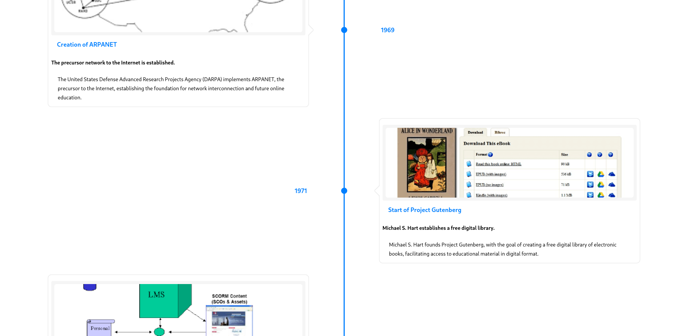

# E-Timeline: The Evolution of E-Learning

An interactive timeline project that visualizes the history and evolution of e-learning from its inception to the present day. This project aims to provide a comprehensive and creative representation of key milestones in e-learning's development.



## 🚀 Purpose

This project was created to research and document the historical evolution of e-learning technologies, methodologies, and approaches. By presenting this information in an interactive timeline, users can better understand how e-learning has transformed education and training over time.

## ✨ Features

- Interactive timeline navigation
- Detailed information about key e-learning milestones
- Responsive design for all devices
- Rich media support (images, videos, text)
- Smooth animations and transitions

## 🛠️ Technologies

- **React**: Frontend library for building user interfaces
- **TypeScript**: Static typing for improved code quality and developer experience
- **Tailwind CSS**: Utility-first CSS framework for rapid UI development
- **react-chrono**: Timeline component library for React applications

## 📋 Prerequisites

- Node.js (v20.0.0 or later)
- npm, yarn, bun, or any other package manager

## 🔧 Installation

1. Clone the repository:

   ```bash
   git clone https://github.com/aikerary/E-timeline.git
   cd E-timeline
   ```

2. Install dependencies:

   ```bash
   npm install
   # or
   yarn install
   ```

3. Start the development server:

   ```bash
   npm run dev
   # or
   yarn dev
   ```

4. Open [http://localhost:3000](http://localhost:3000) in your browser to view the application.

## 📚 Project Structure

```
E-timeline/
├── public/            # Static assets
├── src/
│   ├── assets/        # Images and videos
│   ├── components/    # Reusable UI components
│   ├── data/          # Timeline data and content
│   ├── types/         # TypeScript type definitions
│   ├── App.tsx        # Main application component
│   └── main.tsx       # Application entry point
├── .gitignore
├── package.json
├── README.md
├── tailwind.config.js # Tailwind CSS configuration
└── tsconfig.json      # TypeScript configuration
```

## 🤝 Contributing

Contributions are welcome! Please feel free to submit a Pull Request.

1. Fork the repository
2. Create your feature branch (`git checkout -b feature/amazing-feature`)
3. Commit your changes (`git commit -m 'Add some amazing feature'`)
4. Push to the branch (`git push origin feature/amazing-feature`)
5. Open a Pull Request

Please read our [CONTRIBUTORS](CONTRIBUTORS.md) guide for more details on how to contribute to this project.

## 📝 Code of Conduct

Please read our [Code of Conduct](CODE_OF_CONDUCT.md) to keep our community approachable and respectable.

## 📄 License

This project is licensed under the MIT License - see the [LICENSE](LICENSE) file for details.

## 🙏 Acknowledgements

- [react-chrono](https://github.com/prabhuignoto/react-chrono) - For the amazing timeline component
- All the researchers and historians who have documented the evolution of e-learning
- Educational institutions that have pioneered e-learning technologies

---

Created with ❤️ as part of an educational research project on the evolution of e-learning.
